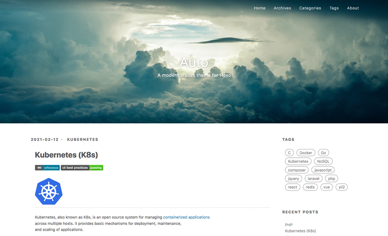

<h1 align="center">Auto</h1>
<p align="center"> 
  Hexo-theme-auto - A modern stylish theme for Hexo
</p>

<p align="center">
  
  
  
</p>





### [Preview](https://autoload.github.io)

## Install

### For hexo < 5.0

``` shell
git clone https://github.com/autoload/hexo-theme-auto.git themes/auto
```

### For hexo >= 5.0

``` shell
npm i hexo-theme-ayer -S
```

- If this theme is newly installed, a `_config.auto.yml` file will be generated in the root directory after the installation is complete, and you can directly edit the `_config.auto.yml` file for configuration.
- If it is a theme upgrade, you can use the configuration method of hexo < 5.0, or you can move the original configuration file to the root directory and rename it to `_config.auto.yml`.

## Enable

Modify `theme` setting in `_config.yml` to `auto`

``` yml
theme: auto
```

## Update

``` bash
cd themes/auto
git pull
```

## Multi Language Support
zh-CN（Simplified Chinese） en（English） zh-TW（traditional Chinese） ja（Japanese） es（Spanish） de（German） fr（French） ru（Russian） ko（Korean） vi（Vietnamese） nl（Dutch） no（Norwegian） pt（Portuguese）

English is default languge, if you want to change, modify `language` option in `_config.yml` file in your blog's root folder.

## Configuration

``` yml
# Menu-Sidebar
menu:
  Home: /
  Archives: /archives
  Categories: /categories
  Tags: /tags
  About: /about

# Sidebar
sidebar: right
widgets:
- tag
- recent_posts
- category
- archive
```


---

<br/>

## Version
### [1.0.0]
init all


## License

MIT License

Copyright © 2020 [David Wan](http://autoload.github.io)
